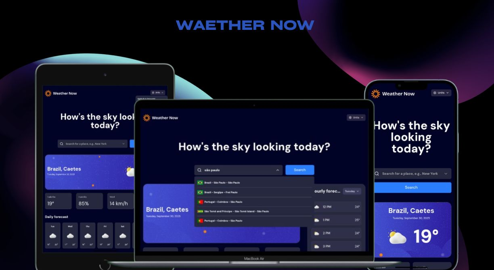

<h1 align="center">Weather Now</h1>
<div align="center">
  <a href="#descrição">Descrição</a> |
  <a href="#iniciar">Iniciar</a> |
  <a href="#licença">Licença</a>
</div>

<p align="center">
  
</p>
<p>
 
</p>

## Descrição

A aplicação e um site que, monstra as variações do clima. Há varias funcionalidades:

- Diferentes formato dos dados, os padrões metric e imperil.
- Buscador, encontre uma cidade e veja sé o clima estar favorável.

Acesse o site **[Weather Now](https://weather-now-ruddy-alpha.vercel.app/)**.

## Iniciar

E Necessário ter o Nodejs e o git instalado.

Faça clone do repositório localmente.

```bash
git clone https://github.com/matheus369k/weather-now.git
cd ./weather-now
```

Instale as dependencies

```bash
pnpm
```

Crie um arquivo **.env**, com as variares ambientes abaixo

```bash
NEXT_PUBLIC_WEATHER_API_URL=https://api.open-meteo.com/v1/forecast
NEXT_PUBLIC_COUNTRY_FLAGS_API_URL=https://restcountries.com/v3.1/name
## For get apiKey access site:https://getgeoapi.com
NEXT_PUBLIC_CURRENT_LOCATION_API_URL=https://api.getgeoapi.com/v2/ip/check?api_key='{ apiKey }'&filter=city,country
```

Agora você pode iniciar o projetos

```bash
pnpm dev
```

## Licença

Licença usada **[MIT](./LICENSE.txt)**
